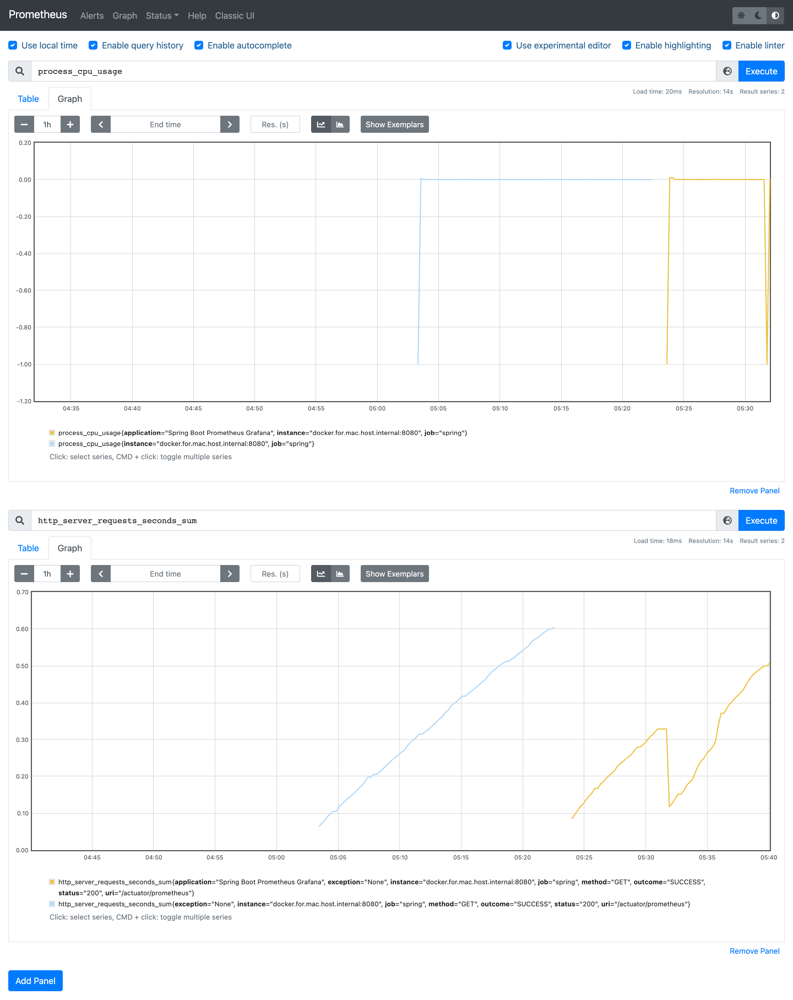

Simple Grafana Dashboard for Spring Actuator Micrometer.
====


docker-compose.yml
----

You can start Prometheus and Grafana Containers with this docker-compose.yml.

```yaml
version: '3.9'
services:
  prometheus:
    image: prom/prometheus:latest
    container_name: prometheus
    volumes:
      - ./prometheus.yml:/etc/prometheus/prometheus.yml
    ports:
      - 9090:9090
  grafana:
    image: grafana/grafana:latest
    container_name: grafana
    ports:
      - 3000:3000
    env_file:
      - ./grafana.env

```


Prometheus Configuration (e.g. Docker for Mac)
----

```yaml
global:
  scrape_interval:     15s
  evaluation_interval: 15s
  external_labels:
    monitor: 'codelab-monitor'

rule_files:
#   - './alert.rules'

scrape_configs:
  - job_name: 'prometheus'
    static_configs:
      - targets:
          - 'docker.for.mac.host.internal:9090'
  - job_name: 'spring'
    metrics_path: '/actuator/prometheus'
    static_configs:
      - targets:
          - 'docker.for.mac.host.internal:8080'

  - job_name: 'admin'
    metrics_path: '/actuator/prometheus'
    static_configs:
      - targets:
          - 'docker.for.mac.host.internal:8110'
  - job_name: 'contents'
    metrics_path: '/actuator/prometheus'
    static_configs:
      - targets:
          - 'docker.for.mac.host.internal:8200'
  - job_name: 'discovery'
    metrics_path: '/prometheus'
    static_configs:
      - targets:
          - 'docker.for.mac.host.internal:8100'
  - job_name: 'frontend'
    metrics_path: '/actuator/prometheus'
    static_configs:
      - targets:
          - 'docker.for.mac.host.internal:8201'
  - job_name: 'gw'
    metrics_path: '/actuator/prometheus'
    static_configs:
      - targets:
          - 'docker.for.mac.host.internal:8000'
  - job_name: 'zipkin-server'
    metrics_path: '//actuator/prometheus'
    static_configs:
      - targets:
          - 'docker.for.mac.host.internal:9411'

```

You should change `docker.for.mac.host.internal` to the host address.


Grafana Configuration
----

Import `Java Micrometer Basics.json` to your Grafana Server or find this Dashboard(ID: 4683) on Grafana.com.


Spring Boot Configuration
----

```gradle
dependencies {
    ...
    compile 'org.springframework.boot:spring-boot-starter-actuator'
    compile 'io.micrometer:micrometer-spring-legacy:1.0.6'
    compile 'io.micrometer:micrometer-registry-prometheus:1.0.6'  // You should add this line for prometheus.
    ...
```

Prometheus Panel



Grafana JVM Micrometer

.png "Grafana JVM Micrometer")

You can start a sample project of Spring Boot (Ver.2.5.4) with this `proto` folder outside of containers.

Reference:
https://keepgrowing.in/tools/how-to-set-up-grafana-with-docker-and-connect-it-to-prometheus/
https://keepgrowing.in/tools/monitoring-spring-boot-projects-with-prometheus/
